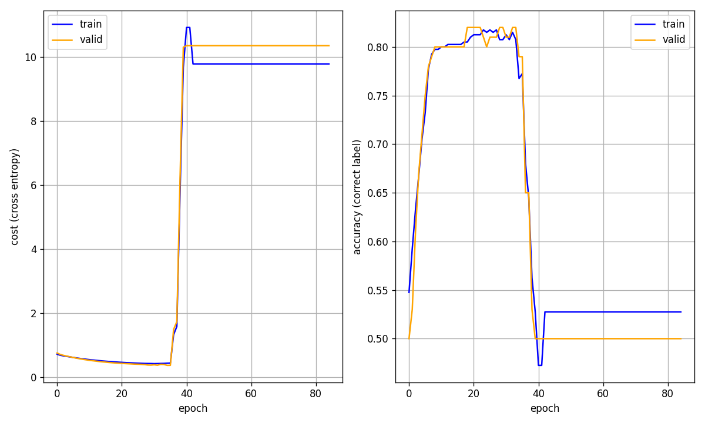

# Simple neural network #

[](https://github.com/elmomoilanen/Simple-neural-network/actions/workflows/main.yml)

Library that implements a simple two hidden layer artificial neural network with NumPy. Purpose of this library is to provide an easy learning and testing environment for the essentials of supervised learning and neural network models in particular.

## Install ## 

Poetry is the recommended tool for installation and the following short guide uses it.

After cloning and navigating to the target folder, running the following command creates a virtual environment within this project directory and installs non-development dependencies inside it

```bash
poetry install --without dev
```

In-project virtual environment setup is controlled in *poetry.toml*. As the *--without dev* option skips installation of the development dependencies, do not include it in the command above if e.g. you want to be able to run the unit tests (pytest is needed for that).

For the plotting to work correctly it might be required to set the backend for Matplotlib. One way to do this is to set the MPLBACKEND environment variable (overrides any matplotlibrc configuration) for the current shell.

## Use ##

Module *neural_network* contains a class *ANN* which implements the two hidden layer neural network model. Its primary public methods are *fit* and *predict*, other two methods *get_fit_results* and *plot_fit_results* can be used to inspect results of the fitting step after it has been run. Selecting appropriate hyperparameters is an important part of the neural network design and for this respect module *evolution* contains a class *Evolution* with a public method *fit* implementing an evolution based algorithm to search an optimal hyperparameter combination.

The following example illustrates the usage of this library. To see the API docs, you can render the [documentation as HTML](#docs) or read the docstrings directly.

Start a new Python shell within the virtual environment e.g. as follows

```bash
MPLBACKEND= poetry run python
```

with a proper backend (e.g. macosx or qt5agg) after the equal sign. If the backend has been set correctly earlier, just drop this setting.

Consider now a typical supervised learning task where the goal is to learn a function **f** between provided example input-output (X-y) pairs such that the learned function would also generalize well for unseen data. Assume that X is a numerical data matrix of shape n x p (n observations, p attributes) and y is an array of labels of size n. As the dependent variable y contains labels, the function **f** classifies each x_i from the input space to the output space. Notice that this example and the synthetic data generation (skipped here) are also presented in the ANN's docstring.

Following code imports the ANN class from the *simple_neural_network* package and fits a model (i.e., learns a function **f**) for the example X-y pairs. We notice that in order to run the model fitting using the ANN's *fit* method, a certain set of hyperparameters must be defined in advance. This can be done manually or automated by an additional hyperparameter optimization step. More on this latter option later.

```python
from simple_neural_network import ANN

ann = ANN(
    hidden_nodes=(40, 15),
    learning_rate=1.0,
    activation1="tanh",
    early_stop_threshold=50,
)

# By default, validation data will be 20 % of the passed data
# Batch size b means ceil(X_train.shape[0]/b) iterations per epoch
ann.fit(X, y.reshape(-1, 1), epochs=500, batch_size=50)

# Fit done, get a summary of the process
ann.get_fit_results()

# Plot cost and accuracy data of the fitting process
ann.plot_fit_results()
```

Summary of the fitting process, obtained by calling the *get_fit_results* method, could be e.g. the following

```
{'epochs': 85, 'train_data': {'smallest_cost': 0.4202, 'smallest_cost_epoch': 31, 'best_acc': 0.8175, 'best_acc_epoch': 24}, 'weights_last_saved_epoch': 35, 'validation_data': {'smallest_cost': 0.3655, 'smallest_cost_epoch': 35, 'best_acc': 0.82, 'best_acc_epoch': 19}}
```

and the related fit results plot



which confirms visually that the cost was minimized around the 35th epoch and immediately afterwards fitting results started to deteriorate. As the neural network parameter *early_stop_threshold* was set to 50, the fitting process was terminated at epoch 85 after 50 consecutive failures to improve the cost score. Best model weights in terms of the cost score were saved after the epoch 35.

Speaking of neural networks in general, learning is said to happen when the weights between neurons adjust during fitting process. Quality or strength of this learning doesn't necessarily increase all along from the beginning to the end and thus it might be a good strategy to halt the fitting process if results don't get better in some T contiguous number of epochs (total passes through the network). As it was already seen above, the optimal model weights are saved to a file, by default to the current working directory with name *weights.h5*. This way the best model is kept available for later use irrespective of how the fitting process goes to the end.

After the model has been fitted we might encounter new input data X_new for which we would like to get the predicted labels y_new. This can simply be done by calling the ANN's *predict* method, and either assuming that a previously created and fitted object is still in memory or in other case passing a file path for the pre-trained neural network weights. For now, we continue from the previous code snippet and reuse the best model weights saved in the file *weights.h5*.

If for some reason we got also y_new (true labels for X_new), we can evaluate the performance of the prediction by using the *confusion_matrix* function from the *metrics* module.

```python
y_new_pred = ann.predict(X_new, "weights.h5")

# Import confusion_matrix directly from the package
from simple_neural_network import confusion_matrix

conf_matrix = confusion_matrix(y_true=y_new, y_pred=y_new_pred)
```

Resulted confusion matrix could be in this example e.g. the follow (with 100 new observations in X_new)

```
array([[41, 11],
       [ 5, 43]])
```

Rows of the confusion matrix represent the true labels with zero-based indexing and columns corresponding predicted labels. For example, entry (0, 1) of the table (value 11) represents total count of predicted cases where the true label is zero but predicted one. Thus, diagonal entries indicate the correctly predicted counts.

At the end of this example let's get back to the hyperparameter problem. Finding optimal or even good hyperparameters is a difficult task, one and maybe the most common possibility being just trying different combinations manually. As mentioned above, other option is to use an evolutionary algorithm and for the case of this library, the algorithm found in *evolution* module. This evolution algorithm can be seen as a bit enhanced version of the basic cross-validation approach that would likely take much more time to complete.

The evolution algorithm used here needs for start two parameters N and K that describe the population size (sets of hyperparameters) and number of generations (how long the algorithm will be run). At the start of the first generation, a population of size N is initialized. After that a fitness score (cost) is computed for every member of the population, the members are ordered by the score and top M (< N) and few P (< M) of the worst performers are selected to survive, for random members of the survivors some of their parameters are mutated and finally N-(M+P) new members are reproduced from the survived members making the population size again N. This process, starting from the fitness score computations, is repeated K times.

This evolution algorithm can be used as follows (assume the same input-output data X-y that were used above)

```python
from simple_neural_network import Evolution

# Search the optimal set of hyperparameters with N=20 and K=10
evo = Evolution(generations=10, population_size=20)

evo.fit(X, y.reshape(-1, 1), "classification")
```

where the result of the *fit* method call will be a list of parameter combinations of size 20 where the first combination is the most fittest (has the lowest cost function value). This combination can be passed for a new ANN object or to further narrow down search region of the hyperparameter space.

## Docs ##

Make sure that you included the *docs* dependency group in the installation step.

Render the documentation as HTML with the following command

```bash
sphinx-build -b html docs/source/ docs/build/html
```

and open the starting page docs/build/html/index.html in a browser.
